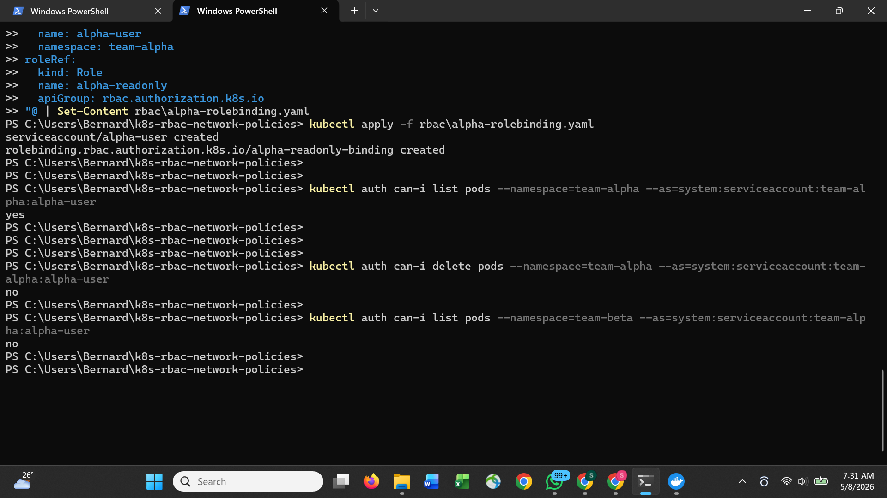
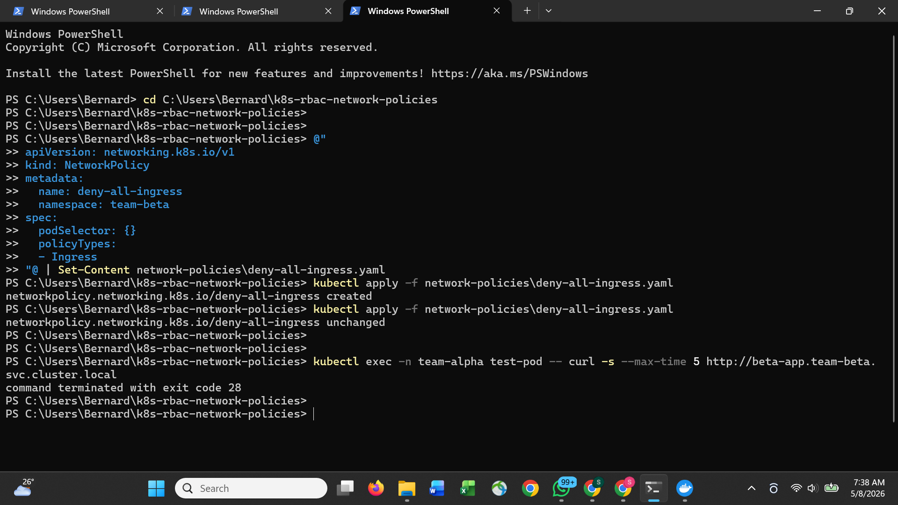
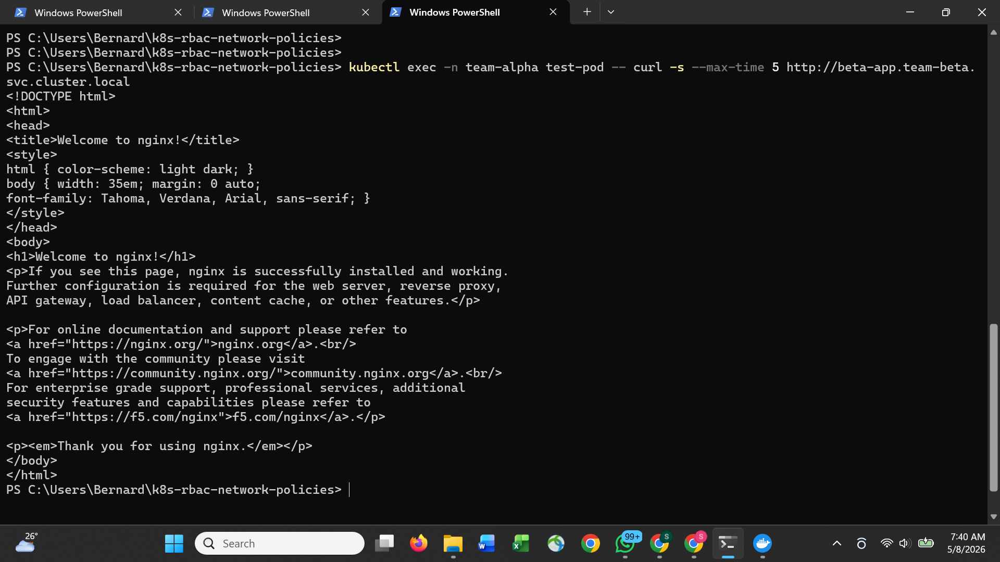

# Kubernetes RBAC and Network Policies

Locking down a Kubernetes cluster properly — namespace isolation, least-privilege
access control, and network policies that restrict pod-to-pod communication
to only what is explicitly allowed.

## What was proved

| Test | Result |
|---|---|
| alpha-user can list pods in team-alpha | yes |
| alpha-user cannot delete pods | no |
| alpha-user cannot access team-beta namespace | no |
| Cross-namespace traffic without policy | open — nginx response received |
| deny-all-ingress network policy applied | blocked — connection timed out |
| allow-from-alpha policy applied | selective access restored |

## Evidence

### RBAC — yes, no, no

### Network policy blocking cross-namespace traffic

### Selective access restored

## Project structure

rbac/alpha-readonly-role.yaml       -- Read-only role for team-alpha
rbac/alpha-rolebinding.yaml         -- Service account + role binding
network-policies/deny-all-ingress.yaml   -- Block all ingress to team-beta
network-policies/allow-from-alpha.yaml   -- Allow only team-alpha into team-beta

## Key concepts demonstrated

Namespace isolation -- two teams, two namespaces, zero cross-contamination by default.

Least privilege RBAC -- alpha-user can read pods and deployments in team-alpha only.
Cannot delete, cannot write, cannot access other namespaces.

Default deny network policy -- all ingress to team-beta blocked by a single policy
with an empty podSelector. Nothing gets in unless explicitly allowed.

Selective allow policy -- team-alpha pods are granted access to team-beta on port 80 only.
All other sources remain blocked.

## Stack

Kubernetes, RBAC, NetworkPolicy, Docker Desktop

## What I would add next

- OPA Gatekeeper to enforce policy as code across the cluster
- Egress network policies to restrict outbound traffic
- Audit logging to track who accessed what and when
- PodSecurityAdmission to prevent privileged containers
- Falco for runtime security monitoring
